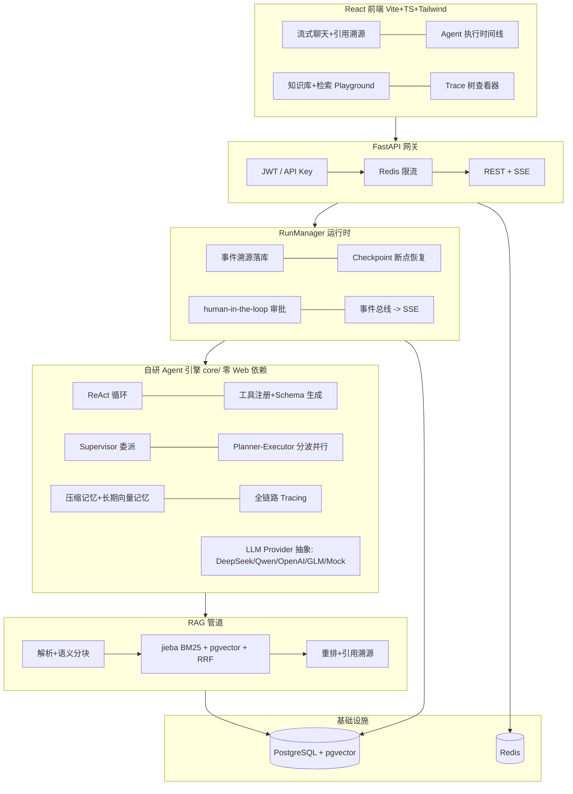

<div align="center">

# AgentForge

**企业级多智能体应用平台 —— 从零自研 Agent 引擎**

自研 ReAct 运行时 · 多 Agent 编排 · Agentic RAG · 深度研究 · 全链路追踪 · 评估体系

[](.github/workflows/ci.yml)
[](backend/pyproject.toml)
[](frontend/package.json)
[](LICENSE)

</div>

---

## 项目简介

AgentForge 是一个**不依赖 LangChain / LangGraph、从协议层开始自研**的多智能体应用平台，覆盖从 Agent 引擎、RAG 管道到评估体系与前端可视化的完整链路：

- **自研 Agent 引擎**：消息协议、工具注册（签名 + docstring 自动生成 JSON Schema）、ReAct 循环、并行工具执行、事件流架构、token 预算熔断；
- **多 Agent 编排**：Supervisor 委派模式 + Planner-Executor 工作流模式（拓扑分波并行），两种范式各有适用场景；
- **深度研究 Agent**：规划 → 并行搜索子 Agent → 证据聚合交叉验证 → 流式撰写带引用报告 → 评审修订；
- **Agentic RAG**：中文友好混合检索（jieba BM25 + pgvector 向量 + RRF 融合 + 可选重排），chunk 级引用溯源；**进阶**：查询改写 / HyDE / 上下文压缩 / 父子分块（small-to-big）；
- **MCP 协议**：作为客户端接入外部 MCP 工具服务器（JSON-RPC，对齐 Anthropic 标准），自动把其工具注入 Agent；
- **安全护栏**：Prompt 注入检测、内容审核、输出 PII 脱敏（输入拦截 + 输出清洗）；
- **语义缓存**：相似问题向量命中复用历史答案，作用域隔离 + TTL + 命中率统计，显著降本提速；
- **工具生态**：内置搜索/抓取/沙箱/计算器/时间等工具 + 在 UI 里自定义 HTTP 工具（运行时动态注入）；
- **企业级基建**：JWT/API Key 双通道认证、Redis 限流（自动降级）、SSE 流式推送（断线续传）、human-in-the-loop 审批、事件溯源 + Checkpoint 断点恢复、全链路 Tracing（tokens/成本/耗时）；
- **评估体系**：检索指标（Recall@K/MRR/nDCG）+ LLM-as-judge（忠实度/相关性/引用规范）+ Agent 任务完成率，一键出报告；
- **可观测看板**：用量/成本/延迟趋势、工具使用 Top、缓存命中率、系统能力总览 + Prometheus `/metrics` 导出；
- **平台化/多用户**：自定义 Agent 构建器（人设+工具+知识库）、每用户每日 token 配额、回答赞踩反馈（可导出为评估数据集）、管理后台（用户/用量/成本总览+配额调整）、数据分析 Agent（CSV → Text2SQL → 图表）；
- **完整前端**：流式聊天（含赞踩反馈）、Agent 执行时间线（含护栏/缓存事件）、审批卡片、知识库管理与检索 Playground、Trace 树、工具管理、可观测看板、自定义 Agent、数据分析、管理后台。

**零依赖可跑**：内置确定性 Mock Provider，不配任何 API Key、不装 Docker 也能完整体验全部功能（含测试与 CI）。

## 总体架构



## 快速开始

### 方式一：轻量模式（最快，无需 Docker）

```bash
cd backend
python -m venv .venv && .venv\Scripts\activate     # Linux/macOS: source .venv/bin/activate
pip install -e ".[dev]"
uvicorn agentforge.main:app --reload               # 默认 SQLite + Mock 模型，开箱即用

# 另开终端启动前端
cd frontend
npm install && npm run dev                          # http://localhost:5173
```

打开 `http://localhost:5173` 注册账号即可体验。知识库页面点「导入演示样例」一键灌入示例语料。

### 方式二：完整模式（PostgreSQL + pgvector + Redis）

```bash
cp .env.example .env                # 按需填入 LLM_API_KEY 等
docker compose up -d postgres redis
cd backend && alembic upgrade head  # 或跳过：应用启动会自动建表
uvicorn agentforge.main:app --reload
```

### 方式三：Docker 一键全栈

```bash
cp .env.example .env
docker compose up -d --build        # 前端 http://localhost:8080，后端 http://localhost:8000
```

### 部署上线（PaaS 单镜像）

根目录 `Dockerfile` 为**单镜像方案**（后端同源托管前端），推到 GitHub 后可在 Render / Railway / Zeabur 等一键部署。详见 [DEPLOY.md](DEPLOY.md)。

### 接入真实大模型

编辑 `.env`（支持 DeepSeek / 通义千问 / OpenAI / GLM / Moonshot / 任意 OpenAI 兼容端点）：

```ini
LLM_PROVIDER=deepseek
LLM_API_KEY=sk-xxxxxxxx
# Embedding 建议用通义（DeepSeek 暂无 embedding API）
EMBEDDING_PROVIDER=qwen
EMBEDDING_API_KEY=sk-xxxxxxxx
# 可选：联网搜索质量更好
TAVILY_API_KEY=tvly-xxxxxxxx
```

不填 Key 时自动降级 Mock 模式（日志会提示），所有链路仍可运行。

## 功能演示路径

| 页面 | 演示点 |
| --- | --- |
| 智能对话 | 绑定知识库提问 → 观察右侧时间线：检索工具调用 → 回答带 [n] 引用角标（悬浮看原文）；让它"写代码算 xx" → 触发沙箱审批卡片（批准/拒绝） |
| 深度研究 | 输入研究主题 → 实时看到研究计划、多个搜索员并行工作、报告流式生成、评审打分 |
| 知识库 | 上传 PDF/Word/Markdown → 检索 Playground 对比 混合/纯向量/纯BM25 的召回与评分拆解 |
| 运行追踪 | 任意一次运行的完整 Span 树：每次 LLM 调用/工具执行的耗时、tokens、成本 |

## 评估体系

```bash
cd backend
python -m agentforge.evals.runner retrieval   # Recall@5 / HitRate@5 / MRR / nDCG@5
python -m agentforge.evals.runner rag         # LLM-as-judge：忠实度/相关性/引用规范 + 延迟/成本
python -m agentforge.evals.runner agent       # 任务完成率 / 平均步数 / 平均成本
python -m agentforge.evals.runner all
```

报告输出到 `backend/evals_reports/`（Markdown + JSON），同时落库 `eval_records` 表。内置中文数据集在 `backend/agentforge/evals/datasets/`，可用 `--dataset` 指定自定义 JSONL。

## 测试与质量

```bash
cd backend
pytest tests -q          # 65 个测试：引擎/工具/记忆/编排/RAG/研究流水线/API 全离线可跑
ruff check agentforge tests
mypy agentforge          # 全量类型检查通过
python scripts/smoke_e2e.py   # 对运行中的服务做端到端验收
```

CI（GitHub Actions）：后端 lint + 类型 + 测试 + 评估管道冒烟；前端 tsc + vite build。

## 项目结构

```
agentforge/
├── backend/
│   ├── agentforge/
│   │   ├── core/                 # 自研引擎（零 Web/DB 依赖，可独立抽库）
│   │   │   ├── llm/              # Provider 抽象：OpenAI 兼容客户端 / Mock / Embedding / 结构化输出 / 定价
│   │   │   ├── tools/            # 工具注册 + Schema 自动生成；搜索/抓取/沙箱/知识库检索
│   │   │   ├── agent.py          # ReAct 循环（并行工具、预算熔断、审批门、Checkpoint）
│   │   │   ├── events.py         # 事件协议（前端/持久化/评估共用契约）
│   │   │   ├── supervisor.py     # 多 Agent 委派编排
│   │   │   ├── planner.py        # Planner-Executor 拓扑分波并行
│   │   │   ├── memory.py         # 滚动压缩记忆 + 长期向量记忆
│   │   │   └── tracing.py        # 全链路 Span 追踪
│   │   ├── rag/                  # 解析/分块/分词/BM25/混合检索/重排/引用
│   │   ├── agents/deep_research.py   # 深度研究流水线
│   │   ├── services/             # RunManager(事件溯源+HITL)/对话/入库/限流/安全
│   │   ├── api/                  # FastAPI 路由 + SSE
│   │   ├── evals/                # 评估框架 + 中文数据集
│   │   └── db/                   # 模型 + 跨方言向量列
│   ├── alembic/                  # 数据库迁移
│   ├── samples/kb/               # 演示语料（虚构企业制度/产品文档）
│   ├── scripts/smoke_e2e.py      # 端到端验收脚本
│   └── tests/                    # pytest 套件（全离线）
├── frontend/                     # React 18 + TS + Tailwind v4
├── docs/
│   ├── architecture.md           # 架构深度解析
│   └── interview-notes.md        # 面试高频问答与简历写法
└── docker-compose.yml
```

## 关键技术决策（面试常问）

详见 [docs/interview-notes.md](docs/interview-notes.md)。摘要：

- **为什么自研而非 LangGraph**：面向学习深度与可控性 —— 事件协议、检查点格式、追踪粒度完全自主；同时保留了对齐业界抽象的能力（工具 Schema 与 OpenAI 规范一致，编排范式与 LangGraph 的 supervisor/subgraph 对应）。
- **可靠性设计**：LLM 重试退避、工具超时与异常回喂自纠错、步数/token 双熔断、入库失败状态机、限流降级、SSE 断线续传（Last-Event-ID 语义）。
- **中文检索**：jieba 搜索粒度分词 + 自研 BM25（Okapi）+ RRF(k=60) 融合 pgvector 余弦召回，SQLite 下自动降级进程内计算，评分口径一致。
- **可扩展性**：事件总线可替换 Redis Pub/Sub 支持多副本；BM25 可迁移 Elasticsearch；沙箱可替换容器级隔离 —— 接口均已预留。

## Roadmap

- [ ] MCP 工具协议接入（对齐 Model Context Protocol）
- [ ] Redis Pub/Sub 事件总线 + 多 worker 水平扩展
- [ ] Agent 记忆的遗忘曲线与重要性衰减
- [ ] 评估回归看板（前端展示 eval_records 趋势）
- [ ] GraphRAG / 多模态文档解析

## License

[MIT](LICENSE)
