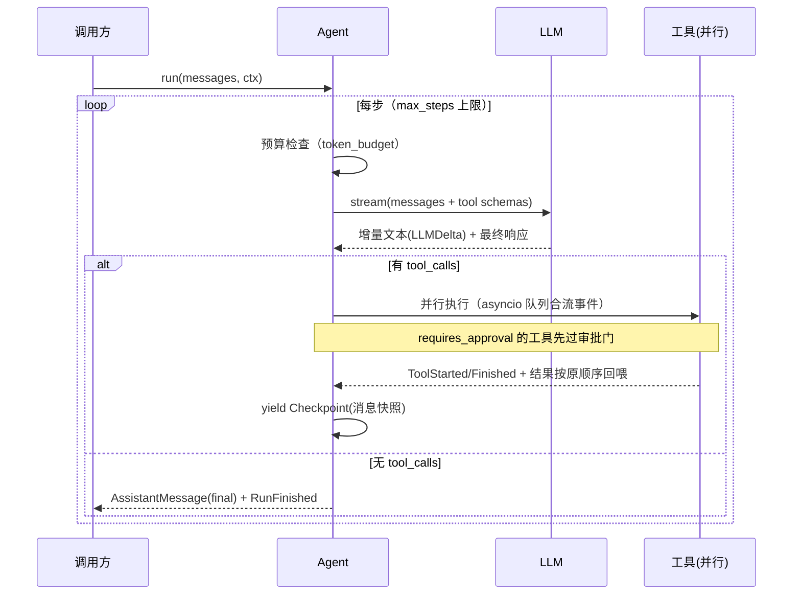

# AgentForge 架构深度解析

本文面向想深入理解实现的读者（以及准备技术面试的你自己）。按"引擎 → 运行时 → RAG → 研究流水线 → 前端契约"的顺序展开。

## 1. 自研 Agent 引擎（`backend/agentforge/core/`）

### 1.1 设计原则

- **零框架依赖**：`core/` 不 import FastAPI/SQLAlchemy，纯 Python + pydantic，可独立抽成 SDK；
- **事件流是一等公民**：`Agent.run()` 返回 `AsyncIterator[AgentEvent]`，SSE 推送、持久化、评估、前端渲染共用同一契约；
- **协议自主**：消息（`messages.py`）与事件（`events.py`）协议自定义，Provider 层负责与 OpenAI wire 格式互转。

### 1.2 ReAct 循环（`agent.py`）



关键细节：

- **并行工具执行**：一批 tool_calls 用独立 task 执行，事件通过 `asyncio.Queue` 实时合流上浮（包括嵌套子 Agent 的事件，经 `ToolContext.emit`），但回喂给模型的 tool 消息严格保持原调用顺序（OpenAI 协议要求）；
- **双熔断**：达到 `max_steps` 或超出 `token_budget` 时，注入系统提示强制模型直接作答且不再携带 tools；
- **自纠错回路**：未知工具、非法 JSON 参数、工具异常/超时都不会中断循环，而是包装为错误文本回喂给模型让它自行调整；
- **审批门（HITL）**：`requires_approval=True` 的工具在执行前 yield `ApprovalRequired` 并 await 应用层注入的 gate（拒绝时把"用户拒绝"作为工具结果回喂）。

### 1.3 两种多 Agent 范式

| | Supervisor（`supervisor.py`） | Planner-Executor（`planner.py`） |
| --- | --- | --- |
| 决策方 | 主管 LLM 动态决定委派谁 | 规划一次成型，代码调度 |
| 实现 | 子 Agent 包装成 `delegate_to_x` 工具，复用 ReAct 循环 | 拓扑排序分波，同波 `merge_streams` 并行 |
| 适用 | 开放式任务、对话式协作 | 结构化任务（如深度研究），可控且成本可预算 |
| 失败处理 | 主管看到失败结果自行调整 | 失败步骤的下游自动跳过 |

### 1.4 记忆（`memory.py`）

- **短期**：估算 token（CJK 0.6/字 + 英文 4 字符/token），超出预算时把旧轮次滚动压缩为摘要（与已有摘要合并），保留最近 N 条原文；
- **长期**：对话结束后 LLM 抽取"值得跨会话记住的事实"（结构化输出）→ 向量化 → 余弦相似度 > 0.92 去重 → 入库；下轮对话按查询召回 top-k 注入系统提示。

### 1.5 全链路追踪（`tracing.py`）

- `contextvars` 维护当前 Span，并发分支（并行工具/并行子 Agent）自动正确挂到父节点；
- Span 树：`agent → llm / tool → retrieval`，记录输入输出摘要、耗时、tokens、按模型定价表估算的成本；
- 运行结束由 RunManager 批量落库（`spans` 表），前端树形展示。选择自研而非 OpenTelemetry：粒度与字段完全贴合 LLM 应用（tokens/成本），无 collector 部署负担；迁移 OTel 只需在 Tracer 上加 exporter。

## 2. 运行时（`services/runs.py`）

### 2.1 事件溯源 + Checkpoint

- 每个 Run 的事件按 `seq` 递增持久化（`run_events` 表）；`llm_delta` 等瞬态事件只推送不落库（全量文本由 `assistant_message`/`report_draft` 兜底），避免 DB 膨胀；
- Agent 每步产出 `Checkpoint`（完整消息快照）写入 `runs.checkpoint`。启动时遗留在途任务统一收敛为 `interrupted`；仅 chat 允许用户手动恢复，且用数据库 CAS 防止并发重复恢复。有副作用的研究工具不会被自动重放。
- **终态一致性**：`run_finished` 被缓冲，等助手消息/报告落库后才作为最后事件发出，杜绝"完成→随后写库失败/取消"的 `finished→failed/cancelled` 矛盾序列；终态之后的最佳努力收尾（长期记忆抽取）吞掉取消，不会把已完成的 run 回退为 cancelled。

### 2.2 SSE 不丢不重

```
订阅顺序：先挂事件总线队列 → 再读库重放（seq > after）→ 消费实时队列（seq 去重）
```

配合 `id: seq` 响应头与 `?after=` 参数实现断线续传；前端保存最后 seq、指数退避重连并幂等去重，15s 心跳防止代理超时断连。

### 2.3 human-in-the-loop

审批门实现为 `asyncio.Future`：运行暂停（状态 `awaiting_approval`）→ 用户通过 `POST /approval` 决策 → Future resolve → 循环继续。超时（10 分钟）自动拒绝，防止任务悬挂。

## 3. RAG 管道（`rag/`）

```
解析(pdf/docx/md) → 标题感知语义分块(重叠) → jieba 分词存 terms + 向量化存 pgvector
查询 → [向量余弦 topN] + [BM25 topN] → RRF(k=60) 融合 → 可选 API 重排 → top_k + 评分拆解
```

- **中文适配**：BM25 建立在 jieba 搜索粒度分词 + 停用词过滤上（英文统一小写），这是中文场景相对"字符 n-gram"或空格分词的关键提升点；
- **BM25 自研**（Okapi 公式，倒排索引），按知识库缓存索引（chunk 计数变化即失效重建）；
- **双方言**：PostgreSQL 用 `embedding <=> CAST(:emb AS vector)` 原生检索；SQLite 自动降级进程内余弦，评分口径一致，保证轻量模式与测试可用；
- **引用可信度**：来源注册表统一编号 [n]，同时保存服务端证据正文与 `verified` provenance；确定性审计检查无效编号、事实句覆盖率和原文读取比例，未知编号不会被前端渲染成可信角标。生成式上下文压缩只有在输出可定位为原文子串时才接受。

## 4. 深度研究流水线（`agents/deep_research.py`）

五阶段：结构化规划 → 并行搜索员（search → fetch → 带引用纪要）→ 证据聚合 → 流式写作 → 评审/修订。评审模型会看到来源证据正文，确定性 CitationAudit 是独立硬门；修订提示包含上一版全文。达到上限仍不通过时保留最佳版本但标记 `needs_review`，禁止公开分享。

工程要点：搜索员共享同一 `RunContext.state`，来源编号全局唯一；`merge_streams` 保证并行事件实时上浮；每阶段独立 Span 记录用量；任一搜索员失败不影响整体（全部失败才终止）。

## 5. LLM Provider 层（`core/llm/`）

- **OpenAI 兼容客户端**：httpx 自研，流式 SSE 解析（增量 tool_call 按 index 聚合）、`stream_options.include_usage` 用量统计、429/5xx 指数退避重试（已输出内容后不再重试防重复）；
- **结构化输出**：JSON Schema 注入提示词 + `json_object` 模式 + 解析失败回喂报错自纠错（最多 2 次）；
- **Mock Provider**：脚本模式（测试断言精确行为）+ 自动模式（能按 JSON Schema 生成合法数据、有工具先调用工具、上下文有 [1] 就带引用），这是"零 Key 全链路可跑"的基石；
- **成本核算**：模型前缀 → 单价表（元/百万 token），Span 与 Run 双层聚合。

## 6. 安全设计

- 密码：标准库 `hashlib.scrypt`（n=16384, r=8, p=1）加盐哈希，常数时间比较；
- API Key：`af_` 前缀 + `secrets.token_urlsafe(32)`，只存 sha256，明文仅创建时返回一次；
- Python 执行器：`python -I` 仅是本地演示用子进程，不宣称安全沙箱；默认关闭，生产配置一旦开启会拒绝启动，镜像也以非 root 用户运行；
- SSRF：web_fetch/自定义 HTTP 工具仅放行全局可路由地址（拦截私有/环回/链路本地含云元数据 169.254.169.254、CGNAT 100.64/10）并禁止自动重定向；公网默认关闭自定义 HTTP 工具。彻底防 DNS 重绑定仍需网络层出口白名单，属部署侧职责；
- 限流：Redis 固定窗口（用户 × 场景维度），不可用时进程内降级并告警日志。

## 6.5 进阶能力（增强模块）

- **MCP 客户端**（`core/mcp/`）：传输层抽象（`StdioTransport` 子进程 / `InMemoryTransport` 测试）+ JSON-RPC 客户端（initialize/tools.list/tools.call）+ `MCPManager` 把外部工具包装为引擎 Tool；单个 server 失败不影响整体。示例 server 见 `samples/mcp_server.py`。
- **安全护栏**（`core/guardrails/`）：`injection`（注入/越狱规则打分）+ `moderation`（内容审核）+ `pii`（脱敏）+ `engine`（编排裁决）。输入命中即拦截，输出统一脱敏；在 `services/chat.py` 接入，事件 `guardrail_triggered`。
- **语义缓存**（`services/semantic_cache.py`）：作用域包含 user/agent/model/embedding/KB revision，时效或指代查询绕过；同轮查询向量供缓存和长期记忆复用，避免重复 Embedding。
- **RAG 进阶**（`rag/enhance.py` + `rag/pipeline.py`）：查询改写 / HyDE（向量与 BM25 查询分离）/ 上下文压缩 / 父子分块（`retriever._expand_parents`）；由 `RagPipeline` 统一编排，检索工具与 Playground 共用。
- **可观测**（`observability/metrics.py` + `api/routers/dashboard.py`）：Prometheus 独立注册表；RunManager 在运行结束记录 run/tool 指标；看板聚合 DB 统计。
- **自定义工具**（`services/custom_tools.py`）：用户定义的 HTTP 接口 → 运行时构建为 Tool；仅在受信任环境显式开启，随对话按 user 动态加载。

## 6.6 生产发布边界

- Docker 启动顺序固定为 `alembic upgrade head → uvicorn --workers 1`，应用生产进程不执行 `create_all`；
- `/api/livez` 只检查进程，`/api/readyz` 检查数据库与 Alembic head；生产日志为 JSON 并携带 request ID；
- RunManager 有全局/用户/会话三级并发准入，数据库故障时也会在 `finally` 关闭 SSE 并释放本地任务名额；
- 当前明确限定单副本单 worker；分布式任务所有权完成前不提供伪水平扩展。

## 7. 水平扩展路径

| 组件 | 当前实现 | 扩展方案 |
| --- | --- | --- |
| 事件总线 | 进程内 asyncio 队列 | Redis Pub/Sub / NATS（接口不变） |
| 后台任务 | FastAPI BackgroundTasks / asyncio task | Celery / ARQ 任务队列 |
| BM25 | 进程内倒排索引 | Elasticsearch / OpenSearch |
| 向量 | pgvector（单机百万级够用） | Milvus / 加 IVF/HNSW 索引 |
| 会话粘性 | 单 worker 无需处理 | run_id 一致性哈希或事件总线广播 |
